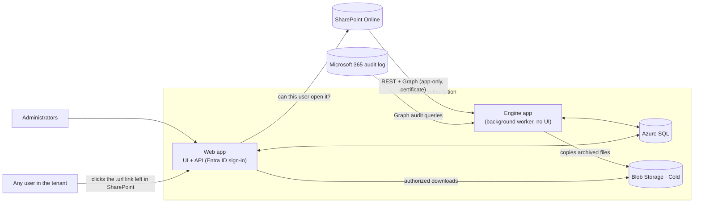

# SpoStorage

**Find out where every byte of your SharePoint Online storage goes — and bring it back under quota.**

SpoStorage is an open-source platform for Microsoft 365 administrators. It inventories a whole SharePoint Online
tenant (sites, libraries, files, historic versions, recycle bins, last access), reconciles it against the storage
Microsoft bills for, and runs **safe, verifiable clean-up policies**:

- 🗑️ **Delete heavy historic versions** (e.g. "files over 100 MB, keep the last 5 versions") — permanently, with
  before/after evidence.
- ❄️ **Archive inactive files to Azure Blob Storage (Cold tier)**, leaving a link in SharePoint that **keeps the
  original permissions**: only the people who could open the file can download it.
- ♻️ **Empty recycle bins** and **limit versions per library** so the problem does not come back.
- 🧪 A **Lab** to try any policy on a handful of files first, with automatic evidence (hashes, versions, recycle bin,
  retention holds, permissions).
- ↩️ **Restore** archived files back to SharePoint with their permissions.

It runs entirely in your own Azure subscription with app-only access (certificate) — no PowerShell sessions, no
desktop agent, and no data leaves your tenant except to your own Blob Storage.

> Measured on a production tenant: **~1,000,000 files / ~36 TB inventoried in ~18 minutes**, re-scanned daily;
> archiving streams at ~15 MB/s per file, 6 files in parallel, and verifies every byte.

## Is this for you?

You probably need it if any of these sounds familiar:

- "SharePoint storage is over quota and we are paying for extra GB every month."
- "Which sites and libraries actually eat the space? The admin centre only shows site totals."
- "Version history is huge, but Microsoft only trims by age or count — not by size, and with no dry run."
- "Nobody opens these old files, but we can't just delete them. We need cheap storage that keeps who-can-open-what."

| Without SpoStorage | With SpoStorage |
|---|---|
| Per-site totals, no explanation | File- and version-level inventory reconciled against what Microsoft bills |
| Trim versions blindly | Simulate, try in the Lab, approve in three steps, keep evidence |
| Delete old files or pay for quota | Archive to Blob Cold with a link that preserves permissions, restore any time |
| One-off PowerShell scripts | A resumable engine with retries, throttling awareness and an audit trail |

## Why

Microsoft 365 gives each tenant a fixed SharePoint quota (1 TB + 10 GB per licence). Tenants that work with large
media or design files often exceed it by an order of magnitude, mostly because of **historic versions** and files
nobody has opened in years. Microsoft offers version trimming by age or count, but not by size, not with a dry run,
and not with archiving that preserves access rules. SpoStorage fills that gap.

## How it works

- **Engine** — a durable task queue in SQL with leases, retries, throttling awareness and a watchdog. It never stops:
  a failing site or file is recorded and skipped, and restarts resume exactly where they left off.
- **Layered reconciliation** — tenant quota → site usage → libraries → files (size *including versions*) → version
  detail for heavy files → last access from the audit log. The UI compares "what the files add up to" with "what
  Microsoft counts", site by site.
- **Policies** — simulate on metadata (no SharePoint calls), materialize a plan, require a **three-step approval**,
  then execute in durable batches with a record of every action.
- **Archive** — stream SharePoint → Blob verifying size and SharePoint's own content hash (QuickXorHash), leave a
  `.url` link with the same permissions, and delete the original only after everything checked out. See
  [docs/archive-and-access.md](docs/archive-and-access.md).

## Screens

| Screen | What it shows |
|---|---|
| **Status** | quota vs usage and overage cost, reconciliation per site, what the engine is doing now, notices (retention holds, pending consents) |
| **Sites** → site | usage, libraries, recycle bin and a **folder explorer** with sizes and "who can open this file" (people and e-mails) |
| **Files** | search by size, versions weight, age, extension, site |
| **Policies** | policy builder with live simulation and plan creation |
| **Lab** | try a policy on up to 20 items with full evidence |
| **Activity** | engine events, runs, failed tasks |
| **Archived** | tree of everything in Blob Cold: metadata, "open in Azure", "show in SharePoint", who can open it, download log, restore |
| `/archive/:id` | end-user download portal (reached from the link in SharePoint) |

## Get started

1. **Deploy** to your subscription: [docs/deployment.md](docs/deployment.md) (Bicep template + a script that creates
   the Entra app registrations and the certificate).
2. **Configure** tenant, storage and administrators: [docs/configuration.md](docs/configuration.md).
3. Grant **admin consent**, open the web app, wait for the first full scan, then start in the **Lab**.

## Documentation

| Document | Contents |
|---|---|
| [docs/architecture.md](docs/architecture.md) | components, engine, reconciliation layers, data model |
| [docs/policies-and-lab.md](docs/policies-and-lab.md) | policy types, simulation, approval, execution, evidence |
| [docs/archive-and-access.md](docs/archive-and-access.md) | archive to Blob + SharePoint link + access control, integrity, restore, how to reuse it |
| [docs/deployment.md](docs/deployment.md) | Azure resources, Entra apps, permissions, CI/CD |
| [docs/configuration.md](docs/configuration.md) | environment variables and runtime settings |
| [docs/operations.md](docs/operations.md) | monitoring, sizing and monthly cost per component, troubleshooting |
| [docs/development.md](docs/development.md) | local setup, tests, code map, how to extend |
| [AGENTS.md](AGENTS.md) | conventions for contributors and AI coding agents |

## Tech stack

Node.js 22 · TypeScript · Fastify · Azure SQL (`mssql`) · React 18 · Vite · TanStack Query · Tailwind CSS ·
Azure App Service · Azure Blob Storage · Microsoft Graph · SharePoint REST · Bicep · GitHub Actions (OIDC).

## FAQ

**Does it need a PowerShell session or a desktop agent?** No. Everything runs in your Azure subscription with an
app-only certificate.

**Does anything leave my tenant?** Only to *your* Blob Storage account. There is no telemetry and no third-party
service.

**How much does it cost to run?** A small App Service plan, Azure SQL (S1 is enough to start) and Blob Cold storage —
see the sizing and monthly cost breakdown in [docs/operations.md](docs/operations.md).

**Is it safe to try?** Yes: the inventory is read-only, simulations never call SharePoint, and every destructive
policy needs explicit approval. Start in the **Lab** with a handful of files.

**OneDrive?** Out of scope for now (per-user quota).

## Status and limitations

- Built for SharePoint Online sites; **OneDrive is out of scope** (it has its own per-user quota).
- Destructive actions are permanent by design (that is how storage is actually freed). Always start in the Lab.
- If a site is under a Microsoft Purview **retention policy or hold**, deleted content is preserved in its
  Preservation Hold Library and keeps counting against quota; the Status page lists affected sites and the Lab detects
  it.
- Restored files get a new "Modified" date (the original date is kept in the archive record).

## Contributing and security

If SpoStorage saves you storage (or money), a ⭐ helps others find it. Ideas, questions and success stories are welcome in
[Discussions](https://github.com/quaglius/SPO-Storage-Extension/discussions).

Contributions are welcome — see [CONTRIBUTING.md](CONTRIBUTING.md). Please report vulnerabilities privately as
described in [SECURITY.md](SECURITY.md).

## Author and contact

Created by **Daniel Quagliano** — questions, feedback or collaboration: **daniel.quagliano@gmail.com**.

## License

[MIT](LICENSE) © 2026 Daniel Quagliano. You can use, modify and redistribute it freely; keep the copyright notice
(credits to the original author) in copies and derivative works.

<!-- Keywords: SharePoint Online storage, SharePoint quota, Microsoft 365 storage management, version history cleanup,
delete old versions, archive SharePoint files to Azure Blob, cold storage, storage audit, reconciliation, tenant
storage report, Preservation Hold Library, Microsoft Graph, SharePoint REST, admin tool. -->
