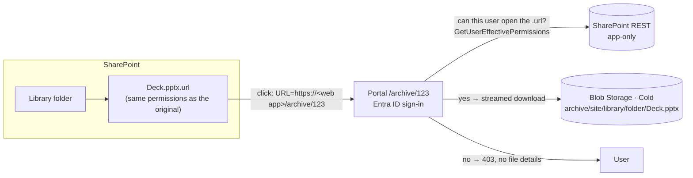

# Archive to Blob Storage with a SharePoint link and access control

How a file moves from SharePoint Online to Azure Blob Storage (Cold tier), what stays in SharePoint, and how the
platform decides who may download it. Written so that someone else can understand, audit and reuse the design.

| Piece | Code |
|---|---|
| Archive executor (copy, verify, link, delete) | [`app/server/src/v2/actions/execute.ts`](../app/server/src/v2/actions/execute.ts) → `executeArchiveFile` |
| SharePoint REST operations (permissions, link upload, delete, effective permissions) | [`app/server/src/v2/actions/sp-ops.ts`](../app/server/src/v2/actions/sp-ops.ts) |
| Download decision | [`app/server/src/v2/actions/access.ts`](../app/server/src/v2/actions/access.ts) → `decideArchiveAccess` |
| "Who can open it" (people with e-mails) | [`app/server/src/v2/actions/access-list.ts`](../app/server/src/v2/actions/access-list.ts) → `describeAccess` |
| QuickXorHash (the hash SharePoint computes) | [`app/server/src/v2/actions/quickxor.ts`](../app/server/src/v2/actions/quickxor.ts) |
| Storage settings, blob names, Azure portal links | [`app/server/src/v2/actions/blob.ts`](../app/server/src/v2/actions/blob.ts) |
| Restore to SharePoint | [`app/server/src/v2/actions/restore.ts`](../app/server/src/v2/actions/restore.ts) |
| Download portal API / page | [`app/server/src/v2/api/archive.ts`](../app/server/src/v2/api/archive.ts) · `app/web/src/pages/ArchivePortalPage.tsx` |
| Tables | `spo.archived_files`, `spo.archive_access_log` |

---

## 1. The idea in one sentence

The file is copied to a blob; in the **same folder** in SharePoint a shortcut `name.ext.url` is left that points to the
platform's portal; **that shortcut carries exactly the permissions the file had**, and the portal only serves the blob
to people SharePoint allows to open that shortcut. Permissions keep living in SharePoint and are managed as usual; the
platform never keeps its own access list to make decisions.



---

## 2. What happens when a file is archived (exact order and guarantees)

`executeArchiveFile` runs in this order. **The original is only deleted in the last step**, and only if everything
before it was verified; if anything fails earlier, the file stays untouched in SharePoint.

```mermaid
sequenceDiagram
  participant E as Engine (app-only)
  participant SP as SharePoint
  participant G as Microsoft Graph
  participant B as Blob (Cold)
  participant DB as Azure SQL
  E->>SP: file exists? size, SMTotalSize
  E->>G: quickXorHash and size of the file (driveItem)
  E->>SP: HasUniqueRoleAssignments + RoleAssignments of the file
  E->>SP: GET …/$value (stream)
  E->>B: uploadStream (Cold tier) computing QuickXor + SHA-256 on the fly
  E->>B: getProperties (size, tier) + metadata sha256/quickxor
  Note over E: Verify: bytes read = SharePoint size = blob size,<br/>computed QuickXor = SharePoint QuickXor
  E->>DB: archived_files (state uploaded)
  E->>SP: upload "name.ext.url" into the same folder
  E->>SP: if the original had unique permissions: copy them to the .url
  E->>SP: re-read the .url permissions and compare with the original
  E->>DB: state linked
  E->>SP: delete the original PERMANENTLY (not to the recycle bin)
  E->>SP: check it is gone (in the Lab also: not in the recycle bin, Preservation Hold Library did not grow)
  E->>DB: state original_deleted; files.deleted_at, files.archived_id
```

| If this fails… | Result |
|---|---|
| Reading, uploading or **any** size/hash check | Action `failed`, "the original was NOT touched". The blob may remain (overwritten on retry). |
| Creating the link, or the permission copy does not match | The link is deleted again, "the original was NOT deleted"; the row stays `uploaded` with `link_error` and the next *Complete archive links* pass retries it. |
| The site has no space for the link (HTTP 507 over quota, or read-only) | The original is deleted anyway (blob verified, ACL stored) and the link is left **pending**: see §2.4. |
| Deleting the original | Retried; the executor is idempotent (an item already `original_deleted` is skipped). |
| The process restarts midway | The engine task resumes and the action runs again from the start (idempotent). |

Idempotency: the blob is overwritten under the same name (storage **versioning** keeps the previous copy), the `.url`
is uploaded with `overwrite=true`, and `archived_files` is keyed by `original_url` (unique).

### 2.4 Pending links (sites over quota)

A site that exceeded its storage quota is read-only for new data, so the `.url` cannot be written, and deleting the
original is exactly what frees the space. When the link write is refused (`HTTP 507`, or a read-only/locked 403/423),
the executor deletes the original and leaves `archived_files.state = original_deleted` with `link_url` NULL and
`link_error` set. Nothing after the delete throws.

**Archive → Complete archive links** (`POST /api/v2/archive/links/complete`, task `archive-complete-links`) makes one
pass over the pending rows (`uploaded`/`linked`, or `original_deleted` without link) and can be launched as often as
wanted; with nothing pending it ends at once. Per row it:

1. re-reads the blob properties (size and SHA-256 must equal the record) and checks the original is unchanged
   (same size, not modified after it was archived, same QuickXor hash in Graph) — otherwise the original is **not**
   deleted and the row is reported for review;
2. resolves the stored ACL (`acl_json`) to this web's permission levels — if one no longer exists, nothing is deleted;
3. creates the link when the site takes it, otherwise deletes the original first and creates it right after;
4. verifies the link permissions against the stored ACL; a link that does not match is deleted again.

The pass never copies, rewrites or deletes blobs, and never changes `sha256`, `blob_path` or `acl_json`. Restore of a
file with unique permissions needs its link: complete the links first.

### 2.1 Integrity

- **QuickXorHash** is the content hash SharePoint/OneDrive publish in Graph (`driveItem.file.hashes.quickXorHash`). It
  is computed over the same bytes that are uploaded to the blob and must equal SharePoint's: this proves the blob is
  the file SharePoint had, without downloading it again.
- **SHA-256** is also computed on the fly and stored (`archived_files.sha256` and blob metadata) for future checks that
  do not depend on Microsoft. Restore requires it to match.
- **Sizes**: bytes read = size in SharePoint = blob `contentLength`.

### 2.2 The shortcut (`.url`)

A plain-text Internet Shortcut in the same folder, named after the original plus `.url`:

```ini
[InternetShortcut]
URL=https://<your web app>/archive/123
```

SharePoint Online treats `.url` files as links: clicking opens the URL. `123` is `spo.archived_files.id` — it is not a
secret; knowing it grants nothing (see §3).

### 2.3 Copying permissions to the link

- If the original **inherits** permissions (the common case), the `.url` created in the same folder inherits the same
  ones: nothing is changed.
- If the original has **unique** permissions:
  1. `breakroleinheritance(copyRoleAssignments=false, clearSubscopes=true)` on the `.url`;
  2. remove assignments that are not on the original (e.g. the one SharePoint adds for whoever breaks inheritance);
  3. add every assignment of the original (principal + role), **except "Limited Access"** (`RoleTypeKind = 1`), which
     SharePoint manages itself and cannot be assigned.
- The link's permissions are then **re-read** and compared (principal, role) with the original's. If they differ, the
  run aborts without deleting the original.
- A **snapshot** of the original permissions is stored in `archived_files.acl_json` for auditing (never used to decide).

"SharingLinks.…" groups (sharing links someone created on the file or folder) are ordinary SharePoint principals: they
are copied and keep working for the people who used them.

---

## 3. Who can download

All traffic goes through the web app, protected by **App Service Authentication (Microsoft Entra ID)** — nobody reaches
the app without signing in with an account of the tenant. The administrator list (`SPOSTORAGE_ADMINS`) restricts the
**whole** app except the portal page (`/archive/:id`) and its API (`/api/v2/portal/*`), which any signed-in user of the
tenant may call.

`decideArchiveAccess(archivedId, upn)` runs on every visit and every download (no cache):

1. The user is a platform administrator → **allowed**.
2. The item was restored to SharePoint → **denied** ("open it from its original folder").
3. The item has no link → **denied**.
4. SharePoint is asked, with the app-only identity, for **this user's** effective permissions on the `.url`:
   `GET {web}/_api/web/GetFileByServerRelativePath(decodedurl='…/name.ext.url')/ListItemAllFields/GetUserEffectivePermissions(@u)?@u='i:0#.f|membership|<upn>'`
5. **Allowed** only if the mask includes **ViewListItems (0x1)** and **OpenItems (0x20)**; otherwise, or if the link no
   longer exists (404) → **denied**.
6. Every decision is written to `spo.archive_access_log` (who, when, allowed or not, reason).

Consequences:

- **Permission changes in SharePoint apply automatically**: remove someone from the folder or group and they cannot
  download on their next visit. There are no lists to synchronize.
- **No fallback to the parent folder** — a file with stricter permissions than its folder would otherwise leak.
- If the `.url` is deleted, nobody except administrators can download until the link is restored.
- Downloads are **streamed** from the blob through the app (managed identity with *Storage Blob Data Contributor*). No
  SAS URLs are issued, so there are no links that could be forwarded.
- A 403 response contains no file details (name, size, site).

### 3.1 Why the user identity can be trusted

- The app reads the user from `X-MS-CLIENT-PRINCIPAL-NAME`, which **App Service Authentication injects** (and strips
  if sent by the client). In production the header is only trusted when `WEBSITE_AUTH_ENABLED=true`, which App Service
  sets when authentication is on ([`v2/api/auth.ts`](../app/server/src/v2/api/auth.ts)).
- The **engine** app has no authentication in front of it, so it only answers `GET /api/health` and returns 404 for
  everything else ([`plugins/engine-lockdown.ts`](../app/server/src/plugins/engine-lockdown.ts)). Without this, anyone
  could forge the header against it.

### 3.2 "Who can open it" (admin screens)

`describeAccess` shows administrators the people who can open a file (or its link): it reads the role assignments and
expands

- users → their e-mail;
- SharePoint groups → their members (`/_api/web/sitegroups/getbyid(id)/users`);
- Microsoft 365 / Entra groups (`federateddirectoryclaimprovider` / `tenant` claims) → transitive members through Graph
  (`/groups/{id}/transitiveMembers/microsoft.graph.user`, needs `GroupMember.Read.All`);
- "Everyone except external users" (`spo-grid-all-users`) → flagged as the whole organization.

It is informational only; the download decision is always §3.

---

## 4. Restore to SharePoint

**Restore** in the Archived screen (administrators) → `POST /api/v2/archive/item/:id/restore` → engine task
`archive-restore` ([`restore.ts`](../app/server/src/v2/actions/restore.ts)). The mirror image of archiving, with the
same rules:

1. **Never overwrites**: if a file already exists at the original path it fails without touching anything
   (`AddUsingPath(overwrite=false)`).
2. Uploads the blob in 10 MB chunks (`StartUpload` → `ContinueUpload` → `FinishUpload`, or a single `PUT` of `$value`
   when it fits in one chunk), computing SHA-256 on the way, and requires it to match the one recorded when archiving.
   Otherwise it deletes what it uploaded and fails.
3. Gives the file **the permissions the link has today** (so changes made while archived are kept) and verifies them.
   If the link no longer exists and the original had unique permissions, it **does not restore** — they cannot be
   rebuilt safely.
4. Only then deletes the `.url` (permanently). The blob is kept; the row becomes `state = restored`.
5. Resumable: `restore_state = uploaded` skips the upload when a later step failed.

---

## 5. Where things live

- **Storage account** (`ARCHIVE_STORAGE_ACCOUNT`), container `archive` by default, default tier Cold. Recommended
  protection (the Bicep template sets it): blob and container soft delete (90 days), versioning, and a `CanNotDelete`
  lock on the account. Once the original is deleted, **the blob is the only copy**.
- **Blob name** mirrors the SharePoint location: `<site>/<library>/<folders>/<file>` (`blobPathFor`), so the Azure
  portal shows the same tree users know.
- **Blob metadata**: `sourceurl`, `site`, `listitem`, `sha256`, `quickxor`.
- **Row** `spo.archived_files`: site, original path, name, size, sha256, content type, container, blob, tier, `link_url`,
  `unique_perms`, `acl_json`, original last-modified date and editor, state (`uploaded` → `linked` →
  `original_deleted` → `restored`, or `failed`), `link_error`/`link_attempted_at` while the link is pending, run and who
  archived it, restore fields.

---

## 6. Permissions the platform needs

Engine app registration (app-only, **certificate** — SharePoint REST rejects app-only tokens obtained with a client
secret):

| API | Application permission | Used for |
|---|---|---|
| SharePoint | `Sites.FullControl.All` | inventory, uploading the `.url`, copying permissions, deleting the original, `GetUserEffectivePermissions` |
| Microsoft Graph | `Sites.Read.All` | `quickXorHash` of files |
| Microsoft Graph | `GroupMember.Read.All` | members of groups in "who can open it" |
| Microsoft Graph | `AuditLogsQuery-SharePoint.Read.All` | last access (audit log) |
| Office 365 Management APIs | `ActivityFeed.Read` | reserved for continuous audit ingestion |

Web sign-in app registration: App Service Authentication for users. Managed identities of both App Services:
*Storage Blob Data Contributor* on the archive storage account.

---

## 7. Reusing the design in another project

Copy:

1. `quickxor.ts` (no dependencies).
2. From `sp-ops.ts`: `readRoleAssignments`, `hasUniquePermissions`, `applyRoleAssignments`, `assignableRoles`,
   `uploadSmallFile`, `deleteFilePermanently`, `fileExists`, `userCanOpen`, `graphQuickXorHash`.
3. From `execute.ts`: `executeArchiveFile` (replace `db()` with your persistence).
4. From `access.ts`: `decideArchiveAccess` (replace the admin list with your own rule).
5. An authenticated endpoint (App Service Authentication or any OIDC front end that guarantees the UPN) that calls
   `decideArchiveAccess` and, if allowed, streams the blob.

Invariants not to break:

- Never delete the original before verifying size + QuickXor and the permission copy.
- **Always** decide access against SharePoint (the `.url`) at download time; never against a stored copy of the ACL.
- Never trust an identity header the client can send.
- Never hand out direct blob URLs (SAS) to end users.
